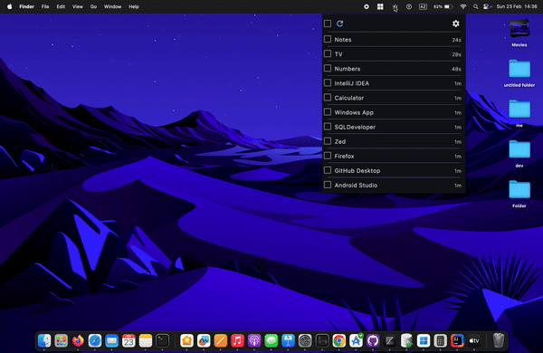

# CloseAll  
**Effortlessly close all open applications on macOS with a single click!**  

  

## ✨ Features  
✅ **One-Click Close** – Instantly shut down all open apps.  
✅ **Customizable** – Choose specific apps to exclude from closing.  
✅ **Only Tray App for Better UX** – Stays in the menu bar for quick and easy access.  
✅ **Dark & Light Mode** – Automatically adapts to your macOS theme.  
✅ **Lightweight & Fast** – Runs seamlessly without slowing down your Mac.  
✅ **Privacy-Focused** – No background tracking or data collection.  

## 🔧 Installation (MacOs)  
1. **Download** the latest .dmg artifact version  from [Releases](https://github.com/Moohaa/CloseAll/releases).
2. Double click on the .dmg artirfact.
3. Move it to the **Applications** folder.
4. Open the **CloseAll** application

## 🚀 Usage  
1. Click on the **CloseAll** icon from the menu bar.  
2. Select applications to close.  
3. Click close icon, then Watch all selected applications shut down instantly!  

## 📌 Coming Improvements  
🔹 **Hotkey Support** – Use a keyboard shortcut for even faster closing.  
🔹 **Auto-Close Schedule** – Set a time for automatic app closing.  
🔹 **Improve Memory Efficiency** – Optimize resource usage for better performance.  

## 💡 Why CloseAll?  
- **Saves Time** – No more manually closing apps one by one.  
- **Boosts Performance** – Free up system resources instantly.  
- **Perfect for Developers & Power Users** – Quickly reset your workspace.  

## 🛠️ Contributing  
Got suggestions or feature requests? Open an [issue](https://github.com/Moohaa/CloseAll/issues) or submit a pull request!  

## 📜 License  
Licensed under the **MIT License** – Free to use, modify, and distribute.  
